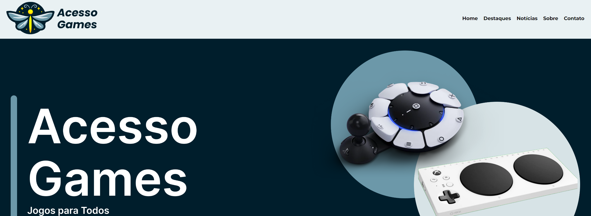

<h1>🎮 Acesso Games PI do Primeiro DSM </h1>
<h2>Desenvolvido por:</h2>
- 💻 Pedro Henrique Xavier Constancio
- 💻 Iago Rodrigues Pinheiro
- 💻 Kairo César Souza Gomes

## ✔️ Tecnologias utilizadas no projeto

- 📚 HTML
- 📚 CSS

## 🕹️ Acessibilidade em Games

Sabia que milhões de pessoas com deficiência são excluídas do mundo dos games todos os dias? Essa realidade nos impulsiona a criar um espaço onde todos possam se divertir e se conectar através dos jogos. Junte-se a nós e ajude a mudar essa história!

O que você encontrará aqui:

- Guias personalizados: Adapte seus jogos favoritos para que se encaixem perfeitamente às suas necessidades.
- Análises detalhadas: Descubra quais jogos oferecem as melhores opções de acessibilidade e quais recursos podem transformar sua experiência.
- Uma comunidade acolhedora: Conecte-se com outros jogadores, compartilhe suas histórias e faça novos amigos.
- Notícias sempre atualizadas: Fique por dentro das últimas novidades sobre acessibilidade nos jogos e descubra como os desenvolvedores estão trabalhando para criar experiências mais inclusivas.

